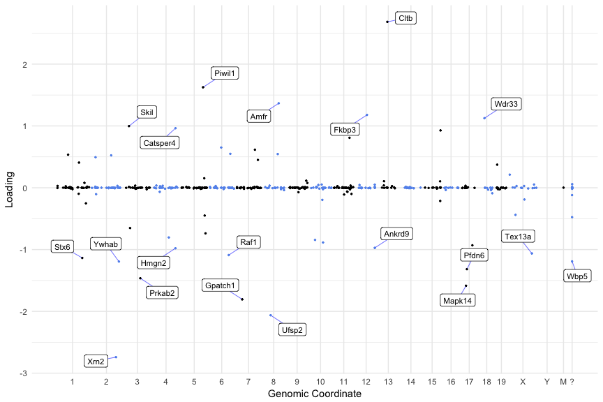

# SDAtools: A toolkit for analysing SDA decompositions

This is a user friendly R package for facilitating the use of [SDA](https://jmarchini.org/sda/), including data formatting, importing results and analysis.

## Installation

```R
# install.packages("remotes")
remotes::install_github("marchinilab/SDAtools")
```
Note that [SDA](https://jmarchini.org/sda/) itself must be downloaded and installed seperately.

## Quick Example Usage
```R
library(SDAtools)

export_data(simulate_2D_data()$Y, name = "simulated.data")

run_SDA(data = "simulated.data", out = "simulation_results")

results <- load_results(results_folder = "simulation_results")

genome_loadings(results$loadings[[1]][8,])
```

<!-- -->

For a full guide on how to use this package please see the [vignette](vignettes/vignette.md).

Contributions and comments of any size or form are welcome!