SDAtools: A toolkit for SDA
================
Daniel Wells
2017-04-19

This vignette is a tutorial for using SDAtools to prepare data for SDA, run SDA, and analyse the results from SDA.

Running SDA within R
--------------------

If SDA is installed on the same machine as SDAtools we can run SDA from within R. As a toy dataset for this vignette I simulate data from the SDA model.

``` r
# Install and Load SDAtools
# devtools::install_github("marchinilab/SDAtools")
library(SDAtools)

# Simulate data
data <- simulate_2D_data()
export_data(data$Y, name = "simulated")

# Run SDA
run_SDA(out = "simulation_results",
        data = "simulated.data",
        N = 100)
```

Load Results
------------

We can easily load the SDA results into an R object.

``` r
# Load the results
results <- load_results(results_folder = "simulation_results", iteration = 5000)
str(results)
```

    ## List of 7
    ##  $ scores           : num [1:100, 1:10] 0.861 0.613 1.81 0.393 1.508 ...
    ##   ..- attr(*, "dimnames")=List of 2
    ##   .. ..$ : NULL
    ##   .. ..$ : chr [1:10] "V1" "V2" "V3" "V4" ...
    ##  $ n                :List of 5
    ##   ..$ individuals     : int 100
    ##   ..$ components      : int 10
    ##   ..$ omics           : int 1
    ##   ..$ context_matrices: int 0
    ##   ..$ iterations      : num 5000
    ##  $ loadings         :List of 1
    ##   ..$ : num [1:10, 1:500] 7.81e-07 8.79e-04 9.73e-08 -1.22e-06 -6.34e-04 ...
    ##   .. ..- attr(*, "dimnames")=List of 2
    ##   .. .. ..$ : NULL
    ##   .. .. ..$ : chr [1:500] "V1" "V2" "V3" "V4" ...
    ##  $ pips             :List of 1
    ##   ..$ : num [1:10, 1:500] 8.32e-06 5.13e-03 3.62e-06 1.04e-05 3.68e-03 ...
    ##   .. ..- attr(*, "dimnames")=List of 2
    ##   .. .. ..$ : NULL
    ##   .. .. ..$ : chr [1:500] "V1" "V2" "V3" "V4" ...
    ##  $ free_energy      : num [1, 1:100] -79533 -79510 -79501 -79492 -79482 ...
    ##   ..- attr(*, "dimnames")=List of 2
    ##   .. ..$ : NULL
    ##   .. ..$ : chr [1:100] "V1" "V2" "V3" "V4" ...
    ##  $ pip_fraction     : num [1:5000] 0 0.782 0.803 0.801 0.797 ...
    ##  $ command_arguments:Classes 'data.table' and 'data.frame':  1 obs. of  11 variables:
    ##   ..$ data              : chr "simulated.data"
    ##   ..$ N                 : chr "100"
    ##   ..$ out               : chr "simulation_results"
    ##   ..$ num_comps         : chr "10"
    ##   ..$ max_iter          : chr "5000"
    ##   ..$ save_freq         : chr "5001"
    ##   ..$ free_freq         : chr "50"
    ##   ..$ ignore_missing    : chr "FALSE"
    ##   ..$ remove_zero_comps : chr "TRUE"
    ##   ..$ num_blocks        : chr "1"
    ##   ..$ num_openmp_threads: chr "1"
    ##   ..- attr(*, ".internal.selfref")=<externalptr>

In this case we also have the true values of the scores so we can compare those to the SDA inferred scores.

``` r
# Compare original and recovered score vectors
check_simulation_scores(data = data, results = results)
```

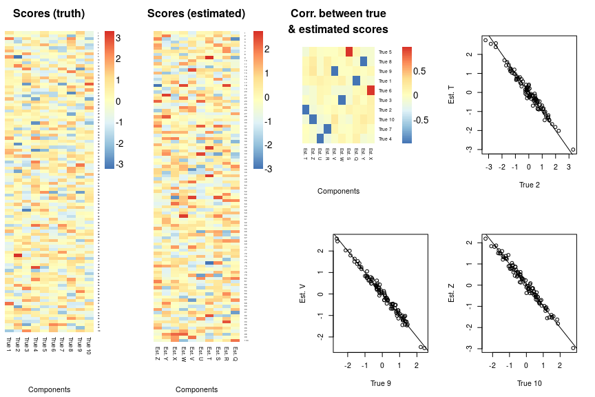

Check Convergence
-----------------

We can check for convergence by seeing if the free energy and % PIP &lt;0.5 have stabalised.

``` r
check_convergence(results)
```

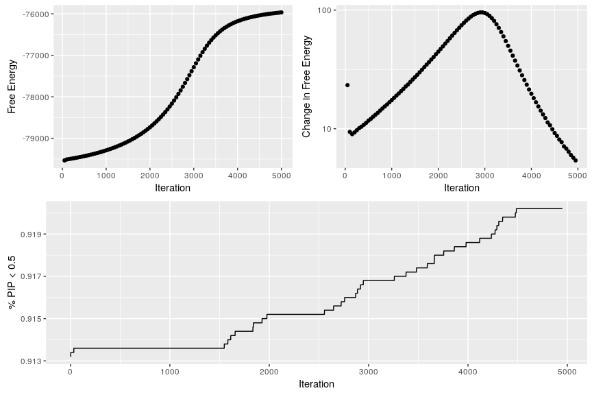

Plot Distributions
------------------

We might want to check the overall distribution of loadings, scores, or PIP.

``` r
loading_distribution(results)
```

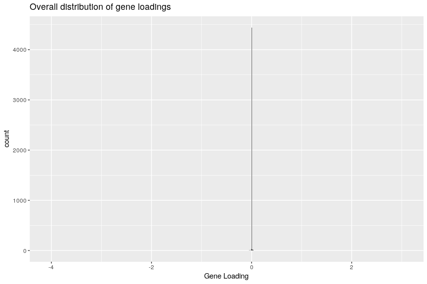

``` r
scores_distribution(results)
```

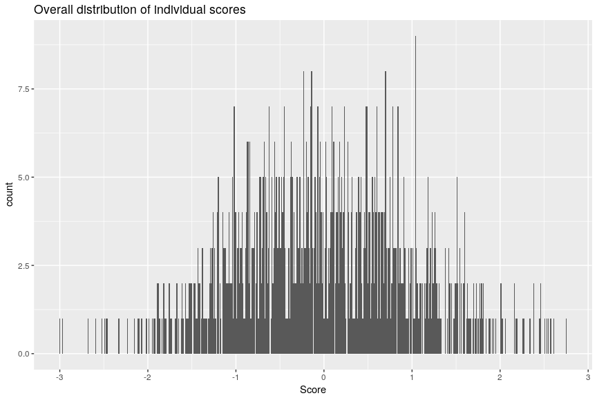

``` r
plot_maximums(results)
```

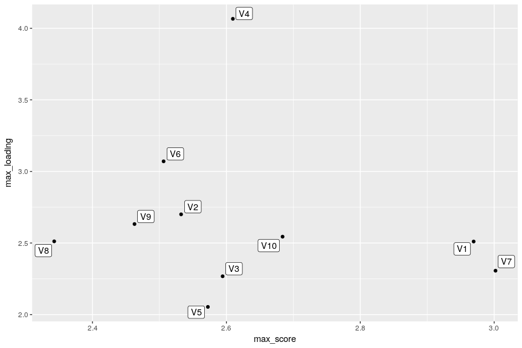

``` r
plot_scree(results)
```

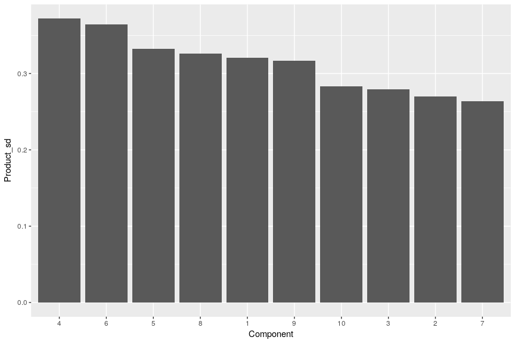

``` r
PIP_distribution(results)
```

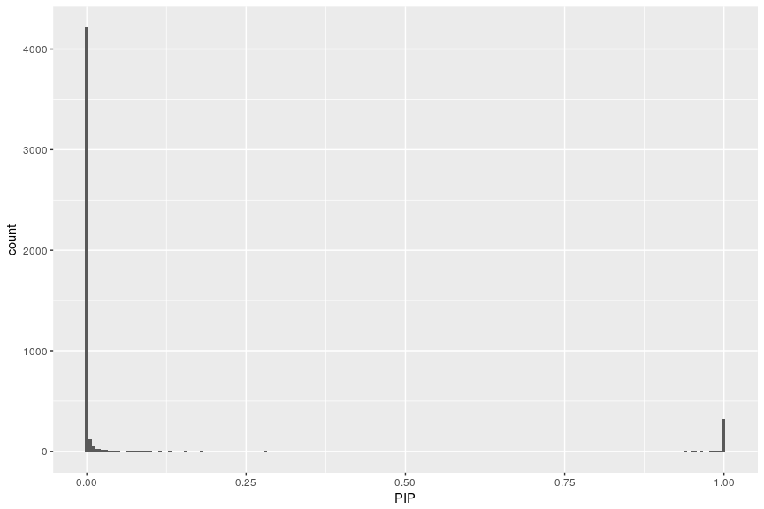

``` r
PIP_component_distribution(results, 2)
```

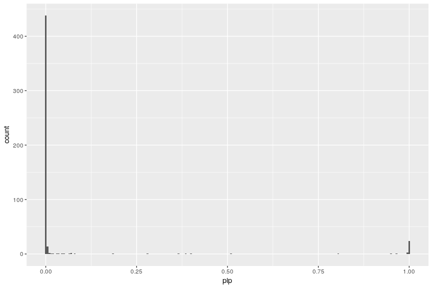

``` r
PIP_threshold_distribution(results)
```

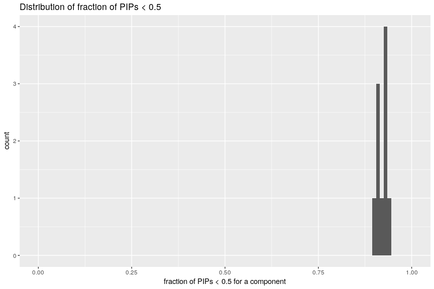

Check Specific Gene / Component
-------------------------------

If we are interested in a specific gene we could check which components have the highest loadings for that gene. We could then check which are the highest genes in that component.

``` r
# Add fake genes labels to variables
colnames(results$loadings[[1]]) <- random_500_gene_names

# Which component has the highest loading for gene 1
highest_components(results, variable_name =  "Xrn1")
```

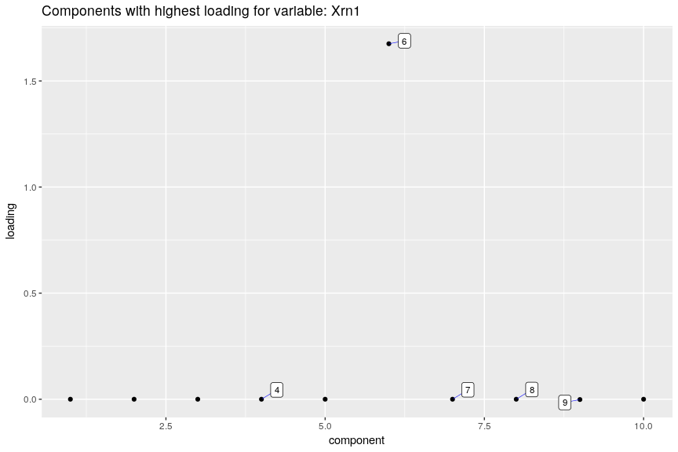

``` r
# Which genes have the highest loading in componetn 1
highest_genes(results, component = 1)
```

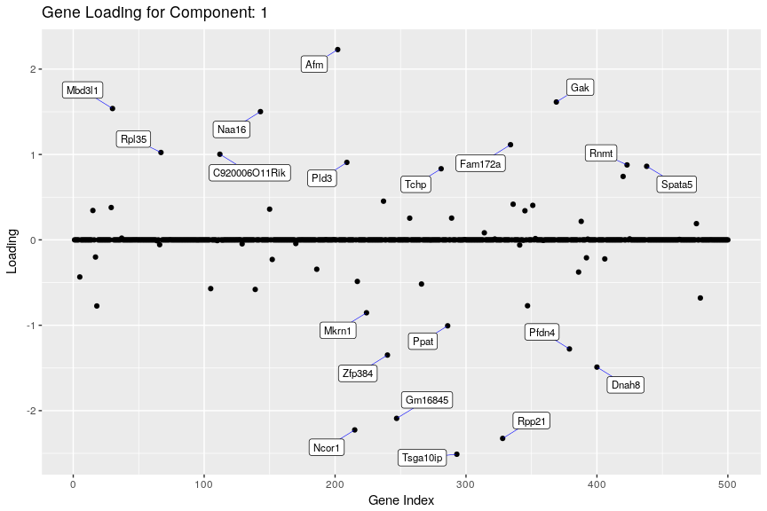

Manhatten-esq plot for loadings
-------------------------------

We can also plot the gene loadings by genomic location

``` r
# Get gene coordinates/locations from Ensembl Biomart
rna_locations <- load_gene_locations(colnames(results$loadings[[1]]))

# Plot loadings along the genome
genome_loadings(results$loadings[[1]][1,], gene_locations=rna_locations)
```

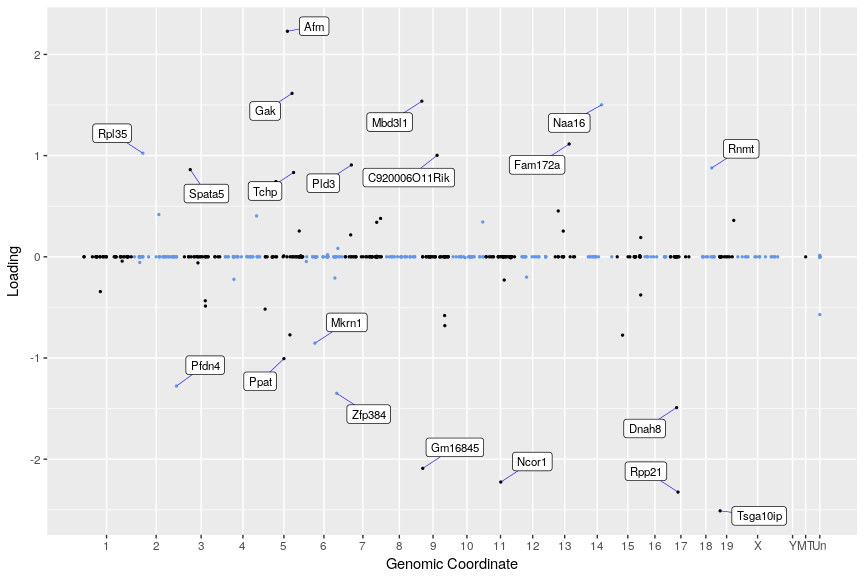

``` r
# Plot individual scores
plot_scores(results, 1)
```

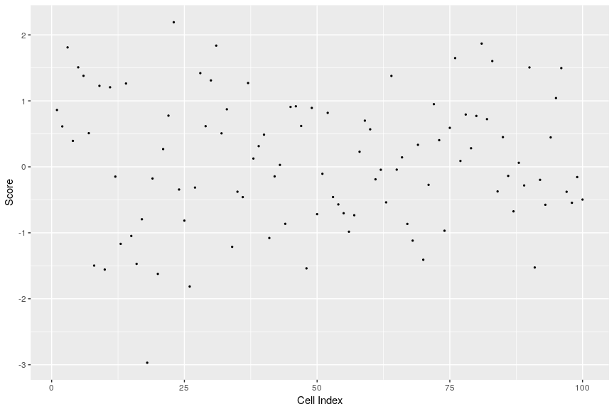
