SDAtools: A toolkit for SDA
================
Daniel Wells
2018-05-09

This vignette is a tutorial for using SDAtools to prepare data for SDA,
run SDA, and analyse the results from SDA. Note that sda itself is not
included in this package and should be downloaded and installed via
<https://jmarchini.org/sda/>

## Running SDA within R

Once SDA is installed we can run SDA from within R. As a toy dataset for
this vignette I simulate data from the SDA model.

``` r
# Install and Load SDAtools
# remotes::install_github("marchinilab/SDAtools")
library(SDAtools)

# Simulate data
set.seed(42)
data <- simulate_2D_data()
export_data(data$Y, name = "simulated.data", path = "../data-raw/")
```

``` r
# Run SDA
run_SDA(out = "../data-raw/simulation_results",
        data = "../data-raw/simulated.data",
        N = 100,
        max_iter = 200,
        save_freq = 200)
```

## Load Results

We can easily load the SDA results into an R object.

``` r
# Load the results
results <- load_results(results_folder = "../data-raw/simulation_results", data_path = "../data-raw/")
str(results)
```

    ## List of 7
    ##  $ scores           : num [1:100, 1:10] 1.4157 -0.7334 -0.0113 0.0596 -0.4093 ...
    ##   ..- attr(*, "dimnames")=List of 2
    ##   .. ..$ : NULL
    ##   .. ..$ : chr [1:10] "V1" "V2" "V3" "V4" ...
    ##  $ n                :List of 5
    ##   ..$ individuals     : int 100
    ##   ..$ components      : int 10
    ##   ..$ omics           : int 1
    ##   ..$ context_matrices: int 0
    ##   ..$ iterations      : chr "200"
    ##  $ loadings         :List of 1
    ##   ..$ : num [1:10, 1:500] 0.004438 0.010356 -0.001241 -0.023387 -0.000376 ...
    ##   .. ..- attr(*, "dimnames")=List of 2
    ##   .. .. ..$ : NULL
    ##   .. .. ..$ : NULL
    ##  $ pips             :List of 1
    ##   ..$ : num [1:10, 1:500] 0.0517 0.0801 0.0345 0.1389 0.0312 ...
    ##   .. ..- attr(*, "dimnames")=List of 2
    ##   .. .. ..$ : NULL
    ##   .. .. ..$ : NULL
    ##  $ free_energy      : num [1, 1:20] -81198 -80414 -79989 -79867 -79852 ...
    ##   ..- attr(*, "dimnames")=List of 2
    ##   .. ..$ : NULL
    ##   .. ..$ : chr [1:20] "V1" "V2" "V3" "V4" ...
    ##  $ pip_fraction     : num [1:200] 0.0002 0.781 0.7974 0.795 0.797 ...
    ##  $ command_arguments:Classes 'data.table' and 'data.frame':  1 obs. of  14 variables:
    ##   ..$ data              : chr "../data-raw/simulated.data"
    ##   ..$ N                 : chr "100"
    ##   ..$ out               : chr "../data-raw/simulation_results"
    ##   ..$ num_comps         : chr "10"
    ##   ..$ max_iter          : chr "200"
    ##   ..$ save_freq         : chr "200"
    ##   ..$ free_freq         : chr "10"
    ##   ..$ ignore_missing    : chr "FALSE"
    ##   ..$ remove_zero_comps : chr "TRUE"
    ##   ..$ num_blocks        : chr "1"
    ##   ..$ num_openmp_threads: chr "1"
    ##   ..$ eigen_parallel    : chr "FALSE"
    ##   ..$ save_everything   : chr "FALSE"
    ##   ..$ debug             : chr "FALSE"
    ##   ..- attr(*, ".internal.selfref")=<externalptr>

In this case we also have the true values of the scores so we can
compare those to the SDA inferred scores.

``` r
# Compare original and recovered score vectors
check_simulation_scores(data = data, results = results)
```

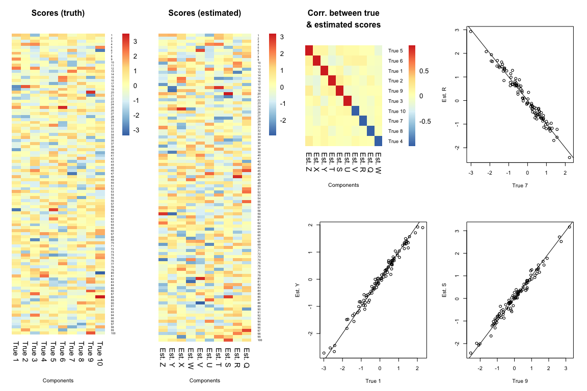<!-- -->

## Check Convergence

We can check for convergence by seeing if the free energy and % PIP
\<0.5 have stabalised.

``` r
check_convergence(results)
```

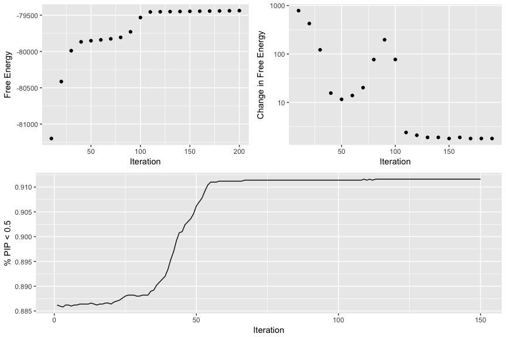<!-- -->

## Plot Distributions

We might want to check the overall distribution of loadings, scores, or
PIP.

``` r
loading_distribution(results)
```

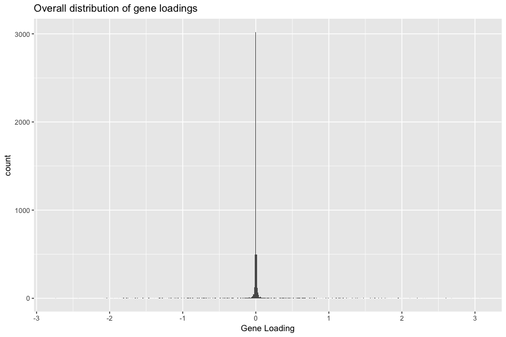<!-- -->

``` r
scores_distribution(results)
```

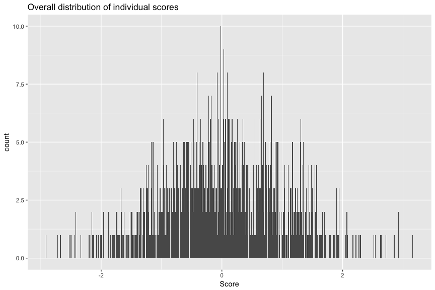<!-- -->

``` r
plot_maximums(results)
```

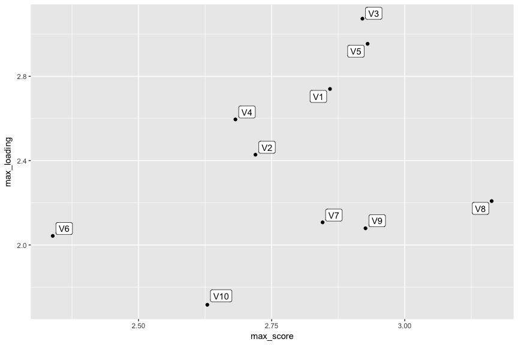<!-- -->

``` r
plot_scree(results)
```

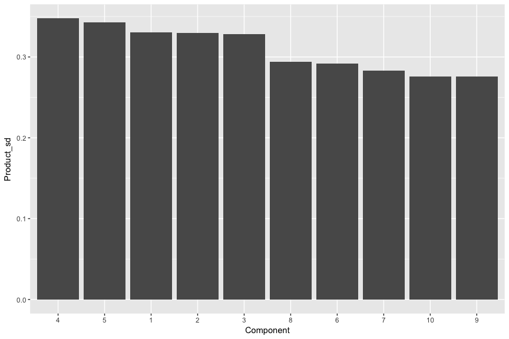<!-- -->

``` r
PIP_distribution(results)
```

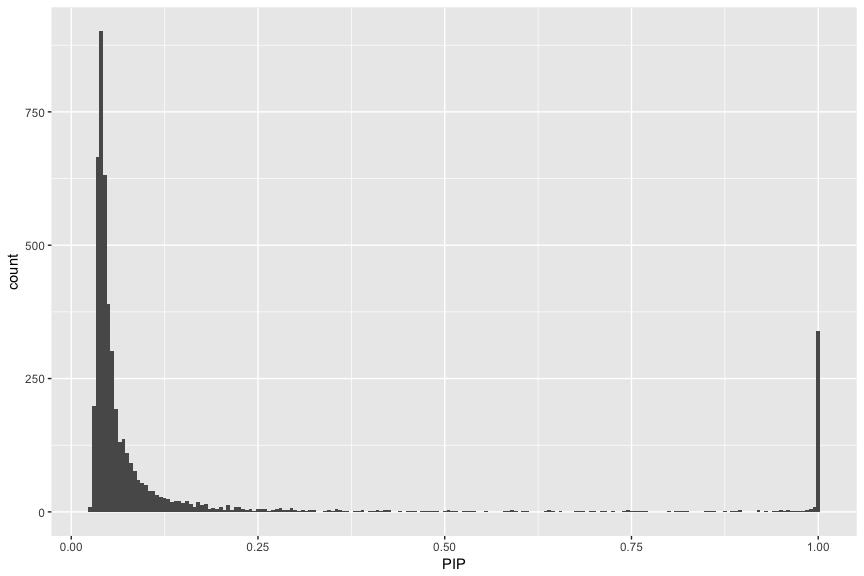<!-- -->

``` r
PIP_component_distribution(results, 2)
```

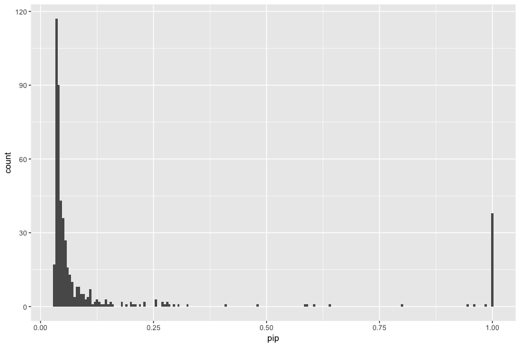<!-- -->

``` r
PIP_threshold_distribution(results)
```

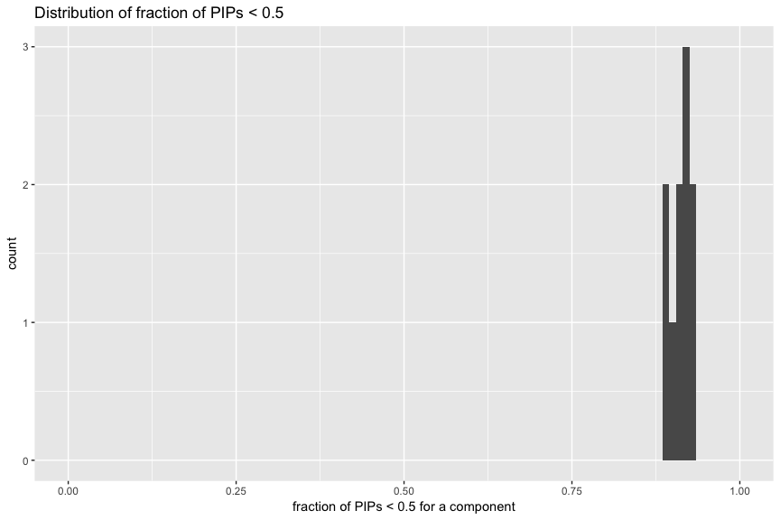<!-- -->

## Check Specific Gene / Component

If we are interested in a specific gene we could check which components
have the highest loadings for that gene. We could then check which are
the highest genes in that component.

``` r
# Add fake genes labels to variables
colnames(results$loadings[[1]]) <- random_500_gene_names

# Which component has the highest loading for gene 1
highest_components(results, variable_name =  "Xrn1")
```

<!-- -->

``` r
# Which genes have the highest loading in component 4
highest_genes(results, component = 4)
```

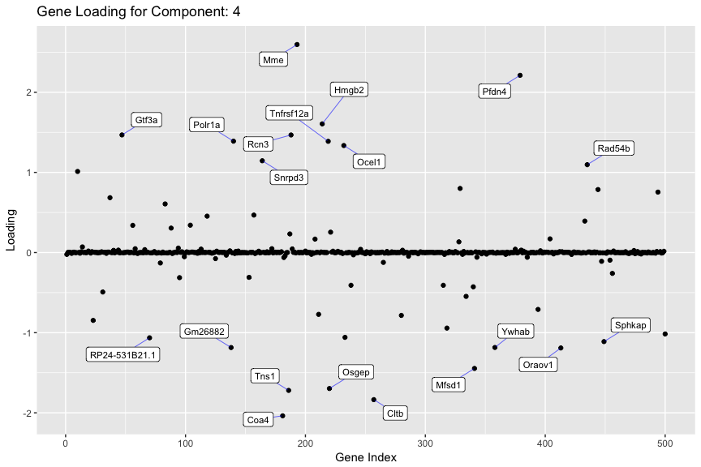<!-- -->

## Manhatten-esq plot for loadings

We can also plot the gene loadings by genomic location

``` r
# Get gene coordinates/locations from Ensembl Biomart
rna_locations <- load_gene_locations(colnames(results$loadings[[1]]))

# Plot loadings along the genome
genome_loadings(results$loadings[[1]][1,], gene_locations=rna_locations)
```

<!-- -->

``` r
# Plot individual scores
plot_scores(results, 1)
```

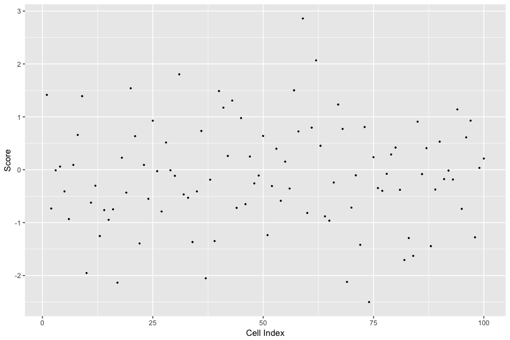<!-- -->
